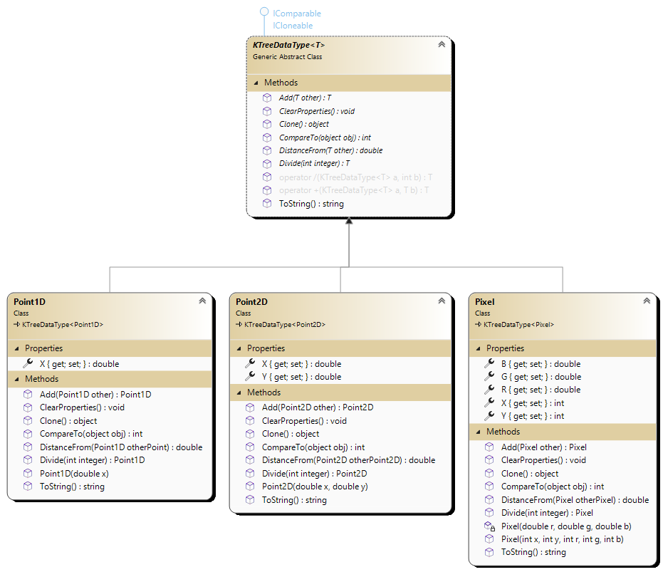
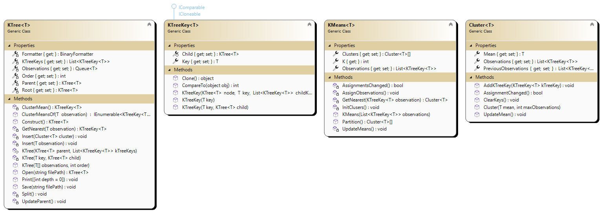

# KTree

This is an OOP implementation of the *K-tree*, written in *C#*. The [K-tree](https://eprints.qut.edu.au/16976/) is a balanced hierarchical data structure and clustering algorithm. It is most applicable to the clustering of large data sets, where the data is typically multi-dimensional. Its hierarchical structure allows for swift data retrieval through means of a nearest-neighbour search.

## Example Clusterings

### [Bliss](https://en.wikipedia.org/wiki/Bliss_(image)) (Order 5 = 10 Levels of Clustering)

### [QUT Gardens Theatre](https://www.qut.edu.au/about/campuses-and-facilities/gardens-point-campus) (Order 5 = 12 Levels of Clustering)

### [Rainbow Lorikeet](https://www.thesenior.com.au/story/6509471/lorikeets-rule-the-roost-again/) (Order 5 = 12 Levels of Clustering)

## OOP Design
### KTreeDataType

### KTree

